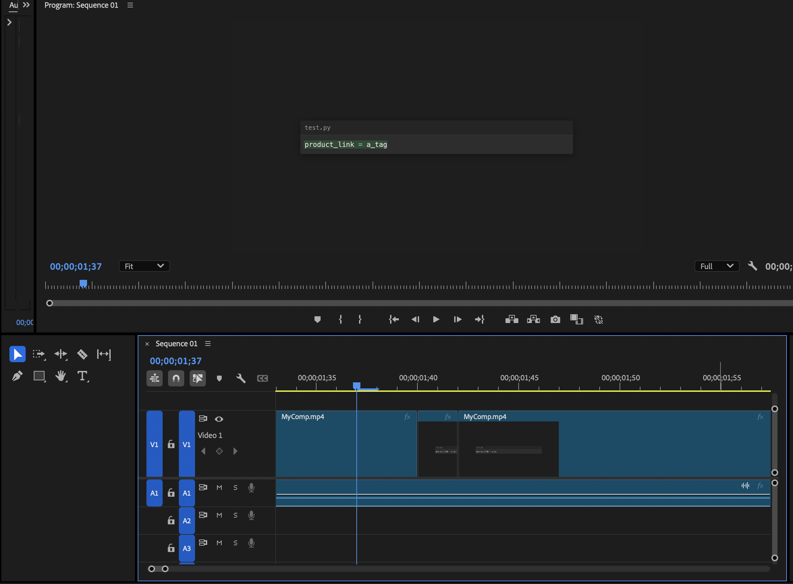

# render-code
Turn Markdown into animated programming tutorials using remotion.


[](https://www.linkedin.com/in/davidteather/) [](https://github.com/sponsors/davidteather) [](https://github.com/davidteather/render-code/releases) [](https://github.com/davidteather/render-code/blob/main/LICENSE)  [](https://discord.gg/yyPhbfma6f)

🚩 - **warning** this project is still in alpha, you probably shouldn't use this with unsaved premiere pro projects or anything high risk.

## Context

I create some coding tutorials on my [youtube channel](https://www.youtube.com/@DavidTeatherCodes) and it's always annoying to make [fireship io](https://www.youtube.com/@Fireship) inspired coding tutorials. The traditional way that he's done it and I've done it is by putting your entire code block into vs code, "frame by frame" doing a control + z to get them all to instantly appear and be highlighted. This sucks especially if you realize in editing a variable name is spelled wrong.

I've created this to easily convert a markdown file representing this tutorial -> remotion -> premiere pro automations.

## Setup

* `python -m pip install -r requirements.txt`
    * Follow [pymiere's installation guide](https://github.com/qmasingarbe/pymiere) for automating premiere pro actions
    * Install [ffmpeg](https://ffmpeg.org/) to render video

## Usage

1. Define a markdown file see examples in [examples/basic.md](./examples/basic.md), the basic idea is each code block is a "segment"/frame
2. `python main.py render examples/basic.md`
3. Open up premiere pro with a new project, create a sequence
4. `python main.py export examples/basic.md`

### Authoring Markdown

- Code fences support flags and titles:
  - ```ts:{title="app.ts", highlight=false, type_fillin=false, start_from_blank=true}
  - Legacy: ```js:src/index.js (infers title as `index.js`)
- Layouts and cutaways:
  - :::layout direction=row gap=12 sizes=60,40 … :::
  - :::cutaway type=image src="/assets/prem1.png" :::
  - :::cutaway type=gif src="/assets/demo.gif" :::
  - :::cutaway type=video src="/assets/clip.mp4" start=3 end=7 :::
  - :::cutaway type=console title="Terminal" ::: (content) :::

### Settings (optional)

- Per-project precedence (highest first):
  1) `--settings path/to/settings.json`
  2) `<markdown_dir>/settings.json` (auto-detected)
  3) repo root `settings.json`
  - This enables project-specific fps/size/theme/animation without changing code.
- Example shape (partial):
```json
{
  "fps": 60,
  "width": 3840,
  "height": 2160,
  "theme": {"codeFontFamily": "Fira Code, monospace"},
  "animation": {"transitionSeconds": 0.5}
}
```

### Development & Testing

- Install Remotion deps: `python main.py setup`
- Run tests: `cd remotion && npm test` (or `npm run test:coverage`)
- Lint: `cd remotion && npm run lint` (or `npm run lint:fix`)

## Output Examples

### Remotion Output 

Check out the example mp4 [here](./examples/basic/out/MyComp.mp4) or on [youtube](https://youtu.be/6bZJ1EI8RjA)

### Premiere Pro Output

We cut around the frames so you can easily re-size it do whatever your voice over duration ends up being.


Still Typing


Middle cut no "movement"


Post cut, start typing


## Todos

Still early in code and working on more things

* [x] - allow styling control through a `settings.json`
* [ ] - allow "excluded" blocks for like cli runs of in progress code
* [ ] - multi-aspect ratio support
* [ ] - clean up the code 😅